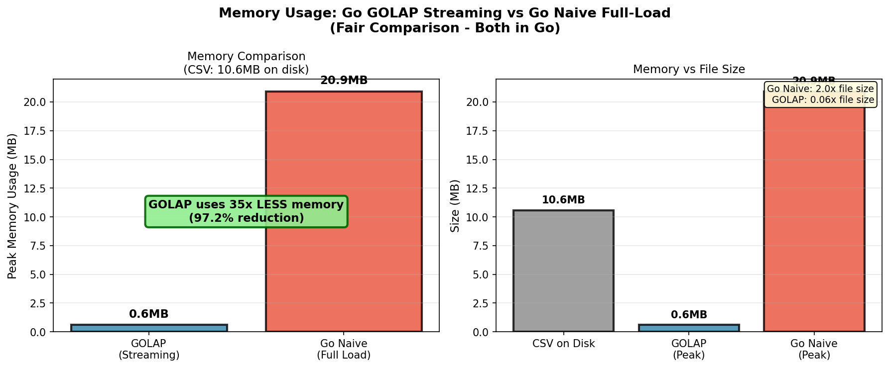
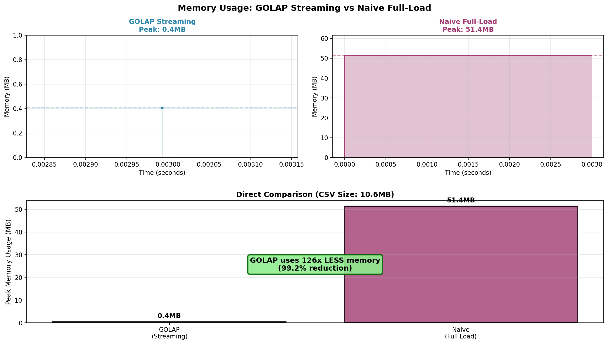

# Golap: Serverless Go OLAP

A lightweight SQL query engine that streams queries over CSV files, delivering constant memory usage regardless of dataset size.

## Why?

Traditional tools load entire files into memory. For a 10GB CSV, it could mean 20-50GB of RAM.

GOLAP uses streaming, it processes one row at a time, using only very little memory even for massive files.

### Memory Comparison

**Go Naive Loading vs GOLAP (same 10MB CSV):**



- Go Naive: 21MB (2x file size)
- GOLAP: 0.6MB
- **35x less memory**

**Python Loading vs GOLAP:**



- Python: 51MB (5x file size)  
- GOLAP: 0.4MB
- **~100x less memory**

## Installation

```bash
git clone https://github.com/aryamaansaha/golap.git
cd golap
go build -o golap .
```

## Usage

```bash
# Basic query
./golap 'SELECT * FROM `data.csv` LIMIT 10'

# Filter and sort
./golap 'SELECT name, age FROM `users.csv` WHERE age > 25 ORDER BY age DESC'

# Aggregations
./golap 'SELECT COUNT(*), SUM(amount), AVG(price) FROM `sales.csv`'

# Group by
./golap 'SELECT category, COUNT(*) FROM `products.csv` GROUP BY category'

# Adjust sort chunk size (for ORDER BY queries)
./golap -sort-chunk-size=5000 'SELECT * FROM `large.csv` ORDER BY value'
```

**Note:** Wrap filenames with backticks (`` ` ``) if they contain dots.

**Flags:**
- `-sort-chunk-size=N`: Number of rows per chunk for ORDER BY (default: 1000)
  - Larger values (e.g., 5000-10000) use more memory but sort faster
  - Smaller values (e.g., 100-500) use less memory but create more temp files

## Supported SQL

- `SELECT` columns or `*`
- `FROM` (CSV file path)
- `WHERE` with `=`, `<`, `>`, `<=`, `>=`, `!=`, `AND`
- `ORDER BY` column `[ASC|DESC]`
- `LIMIT` n
- `GROUP BY`
- Aggregates: `COUNT`, `SUM`, `MIN`, `MAX`, `AVG`

## How It Works

GOLAP uses the **Volcano Iterator Model** - each operator (scan, filter, sort, aggregate) streams rows one at a time:

```
Project → Limit → Sort → Aggregate → Filter → Scan
              ↑
         (pulls one row at a time)
```

For `ORDER BY` on large files, it uses **external merge sort** - sorting chunks on disk, then merging them.

## Use Case

Query large CSV files (local or S3) without loading them into memory. Ideal for:
- Ad-hoc analysis of large datasets
- Memory-constrained environments
- Serverless functions

## License

MIT

